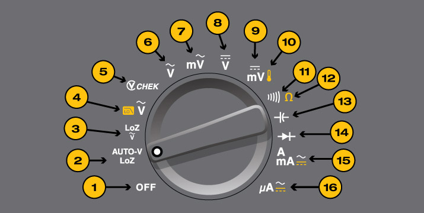

# Electronics Notes

*By John Palermo*

## Table of Contents

## LEDs

### Determining LED Forward Drop

1. Set meter to diode setting (i.e. #14 in this picture).

2. Connect the LED to the meter leads, verifying correct polarity.
3. Meter will indicate forward drop (usually 1V-3V for most LEDs.) Note that the LED may glow.

Now that you have the LED's forward voltage drop you can figure out how much voltage everything else in the "chain" will need to drop. For very simple circuits it may just be a limiting resistor. For more complex circuits it may be a bipolar or field-effect transistor, or maybe even something more esoteric. Either way: The voltage through a series circuit will be distributed through all the elements in the circuit. Let's assume a very simple circuit with a red LED, a resistor and the supply.

If the meter indicated 1.2V Vf for the LED, you know your resistor will have to drop 5V - 1.2V or 3.8V. Assuming you want about 10mA through the LED it's now a simple matter of applying Ohm's law. We know that in a series circuit the current through all elements must be identical, so 10mA through the resistor means 10mA through the LED. So:

     R = V / I
     R = 3.8V / 10mA
     R = 380 ohms
  
If you connect your LED to your 5V supply with a 380 ohm resistor in series, you will find the LED glowing brightly as you intended. Now can your resistor handle the power dissipation? Let's see:

     P = V * I
     P = 3.8V * 10mA
     P = 38mW
  
38mW is well within the dissipation spec for any 1/4 or 1/8W resistor. Generally speaking, you want to stay well under the power rating for a device unless you know what you're doing. It's important to realize that a resistor that is rated for 1/4W will not necessarily be cool to the touch when dissipating 1/4W!

What if you wanted to drive that same LED with a 24V supply? Ohm's law to the rescue again:

     R = V / I
     R = (24V - 1.2V) / 10mA
     R = 22.8V / 10mA
     R = 2280 ohms (let's use 2.4k since it's a standard E24 stock value):
  
And a power check (using an alternate power equation just to change things up):

     P = V^2 / R
     P = 22.8V * 22.8V / 2400 ohms
     P = 217mW
  
Now you'll notice that by driving the applied voltage up we have driven the voltage across the resistor up, and that in turn causes the total power dissipated by the resistor to go up considerably. While 217mW is technically under the 250mW a quarter-Watt resistor can handle, it will get HOT. I'd suggest moving to a 1/2W resistor. (My rule of thumb for resistors is to keep their dissipation to under half their rating unless you're actively cooling them or have specific needs laid out in the specification).

> Written by [akohlsmith](https://electronics.stackexchange.com/users/17429/akohlsmith)
> Answered on [Stack Exchange](https://electronics.stackexchange.com/questions/173468/easy-way-to-figure-out-a-leds-vf-in-order-to-pick-an-appropriate-resistor)

